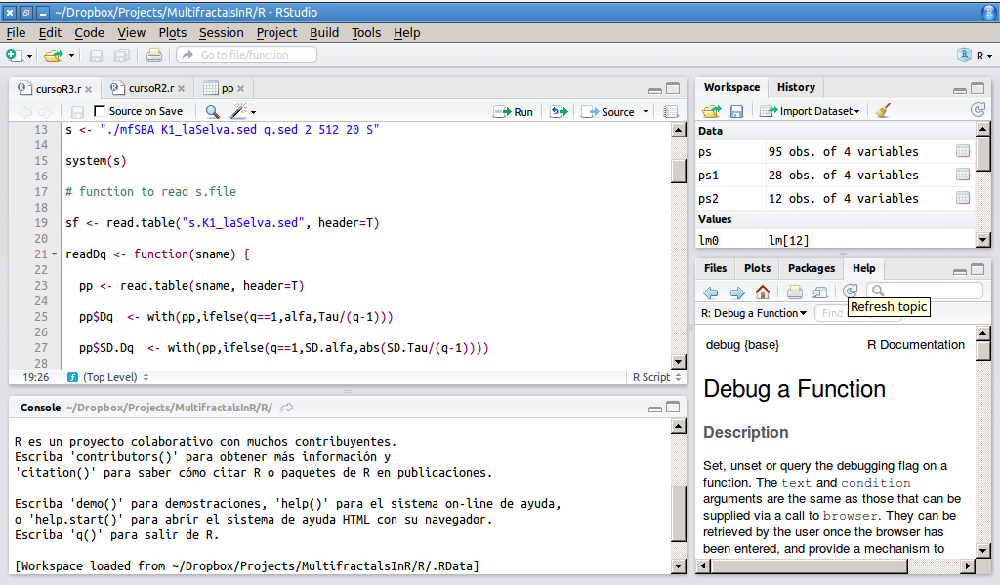

## Multifractals in ecology using R

 

## Overview

The course is an introduction to power laws and generalized dimensions (fractals and multifractals) with applications to ecology, at the same time I introduce the R statistical lenguaje.

> + Day 1
	+ [Introduction to fractals](Curso1.html)
	+ [Introduction to R and RStudio](CursoR1.html)
> + Day 2
	+ [Random walks & rescaled range analysis](Curso2.html)
	+ [R functions and simulations](CursoR2.html)
> + Day 3
	+ [Multifractals \& generalized dimensions](Curso3.html)
	+ [Estimation and simulation: mfSBA \& p-models](CursoR3.html)
> + Day 4 
	+ [Percolation, criticality and Self organization](Curso4.html)
	+ [Models \& Cellular Automata](CursoR4.html)
> + Day 5 
	+ [Methodological issues \& syntesis](Curso5.hmtl)
	+ Application to real data, maybe your data?

## Required knowledge 

+ Some mathematical functions

+ Basic probability & statistics

+ Some programming skills

## Software we will use

+ [R Statistical Languaje](http://www.r-project.org/) \& [RStudio](http://www.rstudio.com/)

	

	
	
  

## General Bibliography

> + Mandelbrot BB (1983) The Fractal Geometry of Nature. W. H. Freeman and Company.

> + Solé R V., Bascompte J (2006) Self-organization in complex ecosystems. Princeton University Press. us

> + Seuront L (2009) Fractals and Multifractals in Ecology and Aquatic Science. Taylor & Francis. 

> + Falconer K. (1990) Fractal Geometry. Mathematical Foundations and Applications. John Wiley & Sons.

> + Harte D. (2001) Multifractals. Theory and Applictions. Chapman & Hall/CRC

