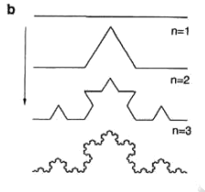
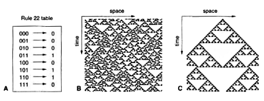

## Multifractals in ecology using R - Day 1

 

## Introduction to fractals and multifractals

* What are fractals?

	+ **Highly irregular** : fractal objects tend to be highly irregular and fill the space in
		which it is embedded.

	+ **Self-similarity** : an object that displays the same basic pattern at all scales. 
	  The simplest fractals are deterministic, and are generated using recursive or
	  iterative procedures.  

	+ **Fractal Dimension** : the characteristic are captured by a dimension that is a measure of complexity of the object.

## Ecological fractals

+ Fractal behavior can be observed looking at different scales. In the next figure (modified from Solé & Bascompte 2006) a beetle species walks on the surface of a trunk with lichens carrying lichens on its back. 

	

	 
	
 

	The spatial distribution of low canopy areas (less than 15m) in a rainforest in Panama (BCI) where clusters of many different sizes can be observed
	

	 
	
 

## Deterministic fractals

+ *The Sierpinsky gasket* : Starting with an equilateral triangle, the procedure
  consist on removing from the central portion an upside down equilateral triangle
  with half the side length of the starting triangle.
  

  
  
 

## Deterministic fractals

+ *The Coch curve*: A segment of length 1 is divided into thirds. The center one is
   	replaced by the other two sides of an equilateral triangle of length 1/3. 
	

  	
  	
 

  	The curve occupies a definite space, but its length $L$ goes to infinity.

	We can compute $L_n$ at different steps $n$

	$L_0=1$

	$L_1=4/3$ 	  	

	$L_2=(4/3)^2$ 	  	

	At an arbitrary step $L_n=(4/3)^n$ that goes to infinity as $n$ grows.	  	

+ Why $L_n=(4/3)^n$ ? 

## Dynamic fractals 

+ *Cellular automata* (CA) are discrete time, discrete space 
	and discrete state dynamical models.
	We will consider a one dimensional CA with N sites. We can think that each site 
	contains one individual of one species $S_i(t)$ for $i=1,...,N$

+ Each time step all elements are updated following a rule table:

	$S_i(t+1) = \Phi \left( S_{i-1}(t),S_{i}(t),S_{i+1}(t) \right)$

	The state of each unit change according to its own state and the state of
	some neighborhood.

+ The simplest case is that we have only one species: the possible states are 0 and 1.

	

  	
  	
 

## Exercise: play with 1D CA 

+ Rule 22 (monogamy) 

		current pattern     111   110    101    100    011    010   001   000  
		-----------------  ----- -----  -----  -----  -----  ----- ----- ----- 
		new state            0     1      1      0      1      0     0     0

	Starting with the following initial configurations

		a) 1 0 1 0 1 0 1 0 1 0

		b) 0 1 1 0 1 0 1 1 0 0

+ But the rule 22 does not generate the Sierpinsky triangle, the following rule generates it:
		
		current pattern    111   110   101   100   011   010   001   000   
		----------------- ----- ----- ----- ----- ----- ----- ----- ----- 
		new state           0     1     0     1     1     0     1     0     

	Starting with the following initial configurations

		a) 0 0 0 0 1 0 0 0 0 0

## Random Fractals

+ All the previous fractals constructions have random analogues.
  In the Von Koch curve we replace the middle third by the sides of an equilateral triangle,
  we might toss a coin to determine the position of the new part above or below the removed 
  segment.

	

	
	
 

## Statistical self similarity

+ The pattern of random fractals is self-similar in the statistical sense. 

	+ A given property $L(r)$, which can be length, mass, population abundance or 
	number or species, measured at some scale of resolution $r$.

	+ Then we look at a different scale $r'=\alpha r$. If $\alpha < 1$ then is a finer
	resolution, else a coarser resolution.

	+ Statistical self similarity means that $L(r)$ is proportional to $L(\alpha r)$

		$L(\alpha r) = k L(r)$

		where k is a constant. 

	+ This definition implies that the statistical features
		of a fractal set are the same when measured at different scales.

## Scaling laws

+ Statistical self similar patterns can be analyzed by power laws or scaling laws

	+ **Zipf's law** : one of the best known scaling laws

		The fraction of cities $N(n)$ with $n$ inhabitants shows a power law dependence:

		$N(n) \propto n^{-r}$ with $r \approx 2$

	+ An example of an ecological scaling law is the frequency distribution of biomass, 
	  the plot shows the cumulative distribution $N(>n)$ against biomass

		

		
		
 

		Scaling in the cumulative biomass distribution of all organisms in lake Konstanz (from Gaedke 1992).

		For a scaling law $N(n) \propto n^{-r}$ we get $N(>n) \propto n^{-r+1}$

## Power laws are scale invariant

+ To show that power laws are scale invariant we can see the effect of a scale transformation.
  	
  	Self similarity implies:

	$\frac{L(r)}{L(\alpha r)}=k$

	Let us assume that $L(r)$ follows a power law

	$L(r)=A r^\eta$

	then

	$\frac{A r^\eta}{A (\alpha r)^\eta} = \frac{1}{\alpha^\eta} = k $ 

## Fractal dimension

+ Let us consider different geometric objects: 
	
	+ A line $\Omega_1$ of length $L$

	+ A square $\Omega_2$ of area $L^2$

	+ A cube  $\Omega_3$ with volume $L^3$

+ We want to cover these with a set of identical non-overlaping segments/squares/cubes of
  side $\epsilon L$ with $\epsilon < 1$.

	  The number of segments required to cover $\Omega_1$ will be

	  $N(\epsilon) = \frac{L}{\epsilon L} =\epsilon^{-1}$

	  For the squares $\frac{L^2}{(\epsilon L)^2} =\epsilon^{-2}$

	  In general

	  $N(\epsilon) = \epsilon^{-d}$

	  Where $d=dim(\Omega_d)$

## Fractal dimension

+ Thus we can define a dimension taking logarithms 

	$$d = -\lim_{\epsilon \to 0}\frac{\log N(\epsilon)}{\log \epsilon}$$

+ Why we need the limits?

+ We can apply it to the Sierpinsky gasket:

	  + For the first step we need 1 triangle of side $\epsilon_0=1$

	  + For the second step we need $N_1(\epsilon)=3$ of side $\epsilon_1=1/2$

	  + In general  $N_n(\epsilon)=3^n$ triangles of side $\epsilon_n=(1/2)^n$

	  + The fractal dimension 

	    $$d = -\lim_{n\to \infty}\frac{\log 3^n}{\log (1/2)^n}=\frac{log 3}{log(1/2)}=1.5849$$

  + This is a non-integrer value between a line dim=1 and a surface dim=2. In general fractal 
    objects have a dimension below of the dimension of the space that contains it.   

+ Exercise: what is the dimension of the Koch Curve

	+ $-\frac{log 4}{log(1/3)}$
 
## Estimation of fractal dimension

+ How to compute fractal dimensions for natural objects that display 
  statistical self similarity?

+ The box counting algorithm 

	+ We cover the object with square non-overlaping boxes of size $\epsilon^2$ and 
	  repeat the procedure using a range of $\epsilon$ values

	+ This range will be limited by the resolution scale $\epsilon_m$ the pixels of 
	  our system, and the system size $\epsilon_M$

	+ For each $\epsilon$ in our range the number of boxes $N_b(\epsilon)$ containing at least one 
	  part of the object will be counted 

	+ Following the definition of dimension we can see that $N_b$ will approximately scale as 

		$N_b(\epsilon) \thicksim \epsilon^{-d}$ 

		in practice $d$ is estimated by the slope of the scaling relation 

		$-\log(N_b(\epsilon))/\log(\epsilon)$ 

## An ecological example

+ The fine scale movement patterns of the ocean sunfish Mola mola (From Seuront 2009). The inset is the detail of the diurnal and nocturnal (shaded) movements. 

	

	
	
 

## Mola mola swimming

+ The fractal dimension was calculated for diurnal and nocturnal movement paths and they were different.
	

	
	
 

+ *lower D during daylight* suggest individuals move in more directed manner. 

+ *Higher D In the night* the movements were more complex suggesting individual interact with environmental heterogeneity on a finer scale. 

+ An increase in the complexity of spatial movements should indicate an increase in foraging or searching effort.

## Characteristic features of fractals

+ Mandelbrot Originally defined fractals as sets that have fractal dimension 
	strictly greater than its topological dimension.

+ There is no hard and fast definition but a list of properties. 

+ We refer to *F* as fractal if: 

	1. *F* has a fine structure: i.e. detail on small scales.

	2. *F* is too irregular to be described by traditional geometrical language

	3. *F* has some form of self-similarity, perhaps approximate or statistical

	4. Usually the fractal dimension of *F* is greater than its topological dimension

## Paper to read

1. Sugihara G, May RM (1990) Applications of fractals in ecology. Trends in Ecology & Evolution 5: 79–86. 

## Bibliography

	Gaedke U (1992) The size distribution of plankton biomass in a large lake and its seasonal variability. Limnology and Oceanography 37: 1202–1220.

	Seuront L (2009) Fractals and Multifractals in Ecology and Aquatic Sciences. 
	Taylor & Francis. 
