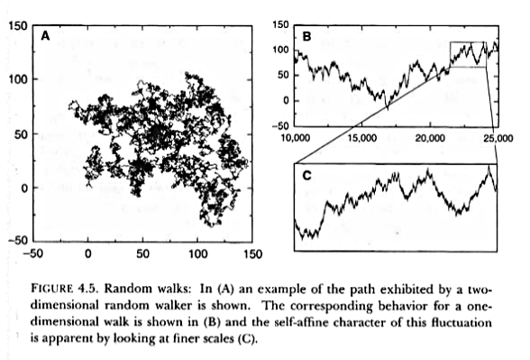

## Multifractals in ecology using R

 

## Characteristic features of fractals

+ Mandelbrot Originally defined fractals as sets that have fractal dimension 
	strictly greater than its topological dimension.

+ There is no hard and fast definition but a list of properties. 

+ We refer to *F* as fractal if: 

	1. *F* has a fine structure: i.e. detail on small scales.

	2. *F* is too irregular to be described by traditional geometrical language

	3. *F* has some form of self-similarity, perhaps approximate or statistical

	4. Usually the fractal dimension of *F* is greater than its topological dimension

## Random walks

+ Random walk (RW) is a stochastic process in which an object moves in a space by performing random jumps

	

	
	
 

+ We can see that the enlarged view of a small part of the trajectory looks similar to the original, is fractal.

+ The pattern displayed by the one dimensional RW is not self-similar but *self-affine* because the time and space dimensions do not scale in the same way

## Fractal time series

+ Fractal properties in time series can be analyzed by means of Hurst's Rescaled Range Analysis

	Let us consider a time series that can be: the number of extinctions of a group of organism or a particular population or the discharge of a river, etc.

	$X_i$ with $i=1,2,3,...,T$

	The average of $X_i$ over $T$ time steps will be $< X >_T = \left( \sum_{i} X_t \right)/T$ 

	The departure from the average over a t-year time horizont is given by:

	$$X(t,T) = \sum_{i=1}^{t} [X_i - < X >_T ] = \left\{ \sum_{i=1}^{T} X_i \right\} - t < X >_T$$

	$X(t,T)$ is usually calculated dividing the time series in $M$ segments of size $T$.

+ What is the value of $X(T,T)$ ?

## Rescaled Range Analysis

+ We need to calculate two more quantities from the previous :

	The standard deviation $S(T) = \left[ (< X_t - <X>_T >)^2 \right]^{1/2}$

	The range $R(T) = \max_{1 \le t \le T} X(t,T) - \min_{1 \le t \le T} X(t,T)$

+ The rescaled range is: $F(T)=R(T)/S(T)$

+ Calculate $F(T)$ using $T=5$ and the following series

		3  4  9  2  1  7  8  2  2  9 

+ When the values of the time series are uncorrelated $F(T) \propto T^{1/2}$, 
  which is called white noise. The best predictor is the last measured value.

+ Hurst found a more general scaling relation $F(T) \propto T^{H}$.
  
  	for the natural systems he analyzed $H > 1/2$ 
  
  	it can be shown (easily) than the fractal dimension is related:

  	$$D = 2 - H$$

+ When the Hurst exponent is greater than 1/2 the system shows persistence on all time scales. 
	An increasing trend in the past implies an increasing trend in the future. 

	If $H < 1/2$ an increase in the past implies a decrease in the future, the system shows antipersistence.

## Papers

1. Meltzer MI, Hastings HM (1992) The use of fractals to assess the ecological impact of increased cattle population: case study from the Runde Communal Land, Zimbabwe. Journal of Applied Ecology 29: 635–646.
