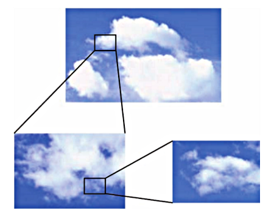
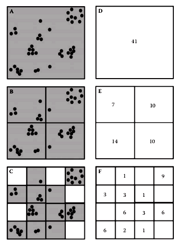
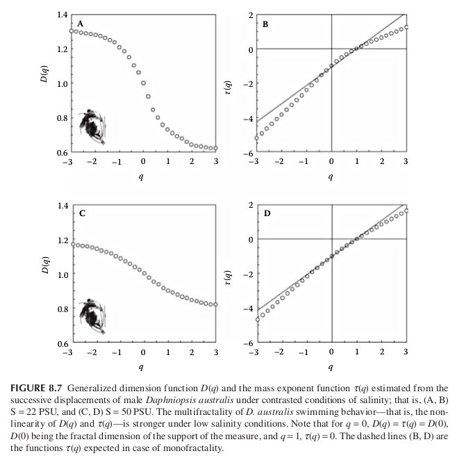

## Multifractals in ecology using R

 

## Multifractals 

+ Many natural systems cannot be characterized by a single number such as the fractal 
	dimension. Instead an infinite spectrum of dimensions must be introduced.

	

	
	
 

## Multifractal definition

+ Consider a given object $\Omega$, its multifractal nature is practically determined by 
	covering the system with a set of boxes $\{B_i(r)\}$ with $(i=1,..., N(r))$ of side lenght $r$ 

+ These boxes are nonoverlaping and such that 
	
	$$\Omega = \bigcup_{i=1}^{N(r)} B_i(r)$$

	This is the box-counting method but now a measure $\mu(B_n)$ for each box is computed. 
	This measure corresponds to the total population or biomass contained in $B_n$, in general
	will scale as:

	$$\mu(B_n) \propto r^\alpha$$

## Box counting

 

## The generalized dimensions

+ The fractal dimension $D$ already defined is actually one of an infinite spectrum of
	so-called correlation dimension of order $q$ or also called Renyi entropies.

	$$D_q = \lim_{r \to 0} \frac{1}{q-1}\frac{log \left[ \sum_{i=1}^{N(r)}p_i^q \right]}{\log r}$$

	where $p_i=\mu(B_i)$ and a normalization is assumed:

	$$\sum_{i=1}^{N(r)}p_i=1$$ 

+ For $q=0$ we have the familiar definition of fractal dimension. To see this we replace $q=0$

	$$D_0 = -\lim_{r \to 0}\frac{N(r)}{\log r}$$

## Generalized dimensions 1

+ It can be shown that the inequality $D_q' \leq D_q$ holds for $q' \geq q$

+ The sum 

	$$M_q(r) = \sum_{i=1}^{N(r)}[\mu(B_i(r))]^q = \sum_{i=1}^{N(r)}p_i^q$$

	is the so-called moment or partition function of order $q$.

+ Varying q allows to measure the non-homogeneity of the pattern. The moments with larger $q$ 
	will be dominated by the densest boxes.  For $q<0$ will come from small $p_i$'s. 

+ Alternatively we can think that for $q>0$, $D_q$ reflects the scaling of the large fluctuations 
	and strong singularities. In contrast, for $q<0$, $D_q$ reflects the scaling of the small fluctuations 
	and weak singularities.

## Exercise 

+ Calculate the partition function for the center and lower images of the figure:

	

	
	
 

## Two important dimensions

+ Two particular cases are $q=1$ and $q=2$. The dimension for $q=1$ is the Shannon entropy or also called by ecologist the Shannon's index of diversity.

	$$D_1 = -\lim_{r \to 0}\sum_{i=1}^{N(r)} p_i \log p_i$$

	and the second is the so-called correlation dimension:

	$$D_2 = -\lim_{r \to 0} \frac{\log \left[ \sum_{i=1}^{N(r)} p_i^2 \right]}{\log r} $$

	the numerator is the log of the Simpson index.

## Application

+ Salinity stress in the cladoceran Daphniopsis Australis. Behavioral experiments
were conducted on individual males, and their successive displacements analyzed 
using the generalized dimension function $D_q$ and the mass exponent function $\tau_q$

	

	
	
 

	both functions indicate that the successive displacements of male D. australis have weaker multifractal properties. This is consistent with and generalizes previous results showing a decrease in the complexity of behavioral sequences under stressful conditions for a range of organisms. 

+ A shift between multifractal and fractal properties or a change in multifractal properties, in animal behavior is then suggested as a potential diagnostic tool to assess animal stress levels and health.

## Mass exponent and Hurst exponent

+ The same information contained in the generalized dimensions can be expressed using mass exponents:

	$$M_q(r) \propto r^{-\tau_q}$$

	This is the scaling of the partition function. For monofractals $\tau_q$ is linear and related to the Hurst exponent:

	$$\tau_q = q H - 1$$

	For multifractals we have 

	$$\tau_q = (q -1) D_q$$	

	Note that for $q=0$, $D_q = \tau_q$ and for $q=1$, $\tau_q=0$

## Paper

1. Kellner JR, Asner GP (2009) Convergent structural responses of tropical forests to diverse disturbance regimes. Ecology Letters 12: 887–897. doi:10.1111/j.1461-0248.2009.01345.x.

