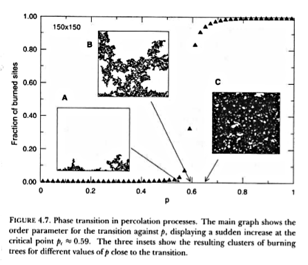
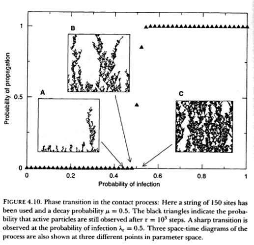

## Multifractals in ecology using R

 

## Percolation

+ We will study the simplest and clearest example of statistical fractal behavior on a two dimensional
  spatial landscape. 

+ Let us consider a $L \times L$ square grid where each site can be occupied by a tree with probability $p$. The state of a site is indicated $S(i,j)$. There are two states occupied=1, empty=0.

+ Each lattice point has four nearest sites: The *neighboorhod* of $(i,j)$ is indicated as $n(i,j)$ 

+ As each site can be occupied independent of the others they do not have any patchiness or spatial correlations

+ What is the probability of finding a path of neighboring trees connecting the bottom to the top?  

+ Our intuition suggest that this probability $P(p,L)$ increase in some monotonous way when $p$ increases.

+ When a cluster of connected sites of length $L$ is present, *percolation* takes place and the cluster is called the *percolation cluster*. From this we can see the emergence of a large scale pattern from local interactions 

+ Let us assume that the trees at the bottom row are burned, their state is indicated by $S(i,j)=2$ the trees with a burned neighbor also burn, thus the fire propagates. 

+ The question is to compute $P(p,L)$

## Percolation and criticality

  

+ There are two well defined phases or domains, separated by a well defined boundary or critical point $p_c$:
	
	When $p < p_c$ the fire cannot spread to far away places. 

	When $p > p_c$ the fire propagate trough the entire set of units.

+ At the critical point the cluster of connected units is fractal, and scaling laws arise.
  The same basic process generate small and large structures.

+ Percolation can be related to invasion process: if the invasive species tend to replace a dominant species, a species that percolates, the invasion will be more successful.

+ In the other direction, when an ecosystem needs a minimal spatial habitat to survive, random habitat loss can lead to percolation, that means breaking available space into many small patches and triggering
ecosystem collapse

+ The problem is that this is a threshold phenomena and can be sudden and unexpected.

## Percolation an infection

+ Let us consider a one dimensional system of $N$ sites $S_i(t)$ where $S_i(t) \epsilon [0,1]$,  healthy=0 and infected=1. 

+ The rules for this system are 
	
	1. Infection: a healthy site become infected proportionate to the infected neighbors 

		$$0 \xrightarrow{\lambda n_i} 1$$

		where $n_i= S_{i+1}+S_{i-1}$, and $\lambda$ the probability of infection in a single contact.

	2. Recovery: an infected individual can recover with probability $\mu$ 

		$$1 \xrightarrow{\mu} 0$$

+ The question is whether the epidemic will persist or become extinct

	

	
	
  

+

## Self-organization

+ Self-organization is defined as a set of dynamical mechanisms whereby structures appear at the global level of a system from interactions among their lower-level components. The interactions between the constituent units are determined by local information, without reference to the global pattern, which is an emergent property (Solé and Bascompte 2006).

+ The characteristics of a self-organizing process are:

	a) the creation of space-time structures from an homogeneous medium;

	b) the possible existence of multiple stable states, because the structures emerge through the amplification of random fluctuations;

	c) the existence of thresholds where a tiny change in a parameter can lead to a qualitative change in the behavior of the system, these are called bifurcations. In this context, the details of the particular biological interactions could be irrelevant for the dynamics of the system, thus a very simple model can describe it successfully

## Paper

1. Weerman EJ, Van Belzen J, Rietkerk M, Temmerman S, Kéfi S, et al. (2012) Changes in diatom patch-size distribution and degradation in a spatially self-organized intertidal mudflat ecosystem. Ecology 93: 608–618. doi:10.1890/11-0625.1.