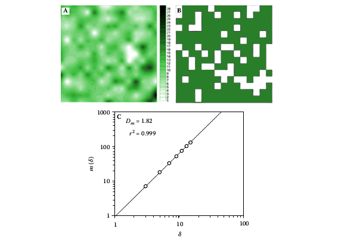
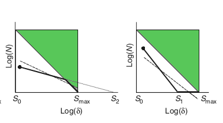

## Multifractals in ecology using R - 5

 

## Not everything is fractal  

+ Before fractality can be affirmed, a power-law relationship between scale and our variable of interest  should hold over a reasonable number of scales. If we want to demonstrate the existence of self-similar mechanisms we should have a reasonable good number of points between our minimum and maximum scales. 

	+ A ratio of maximum scale to minimum scale more than 100 is recommended and a ratio of 1000 is optimal. 

	+ I think that this requirement is too stringent for ecological data and is related to the number of points needed to fit a linear relationship. 

	+ The folowing figure shows the distribution of microphytobenthos chlorophyll-a concentration (modified from [2]) as a continous pattern (A) or a discrete pattern (B) and the scaling behaviour (C) where $\delta$ is the scale

		

		
		
 

		Here the ratio is about 15, but there is no doubt that there is a power law in the extent considered.

+ The box counting method is very sensitive to the amount of area occupied at the finest scale. 
	When we look at coarser scales (bigger $r$) the boxes can be filled before we reach the maximum.
	Alternatively the object could occupy less area than the coarser scales thus after some threshold we count only 1 point.

	

	
	
 

	One should ignore the scales after these limits. Another solution is to estimate higher order fractal dimension, $D_1$ for example, that are less sensitive to 

+ There are other artifact due to the finiteness of natural fractals thus the maximum scale should be (much) less than the maximum extension of the object under study and the minimum scale should be greater than the minimum inter point separation. These problems are all related to the box-counting method and $D_0$.

+ Because small boxes are nested into big boxes the points used for linear regressions are not independent, then p-values and confidence intervals are underestimated. Moreover residuals are typically neither constant in variance nor have a Gaussian distribution. One solution is to examine the number of occupied subcells within a sample of occupied cells at each scale, this will do independent samples for each scale.

+ Objects and edges have different fractal dimensions. For example, vegetation may be defined by
the area covered by the leaves of the plants or by the set of the positions of individuals in space. The question we are asking will determine Which representation we'll choose. 

## Synthesis

+ The intuitive notion that a healthy organism is characterized by regular, mechanistic function has been challenged by observations that a loss complexity is, in fact, indicative of ill-health.

+ Understanding the origins of scaling can provide valuable information about the origins of ecological complexity. 

+ But understanding means that we should investigate the origins of the power law patterns, we should not be satisfied only with a description.

+ Models, experimentation and comparative observational studies should be used in conjunction with previous hypothesis 

+ When we formulate a hypothesis previously to an analysis we are making explicit our ideas about the functioning of the system this improve our understanding and help to reduce bias. 

+ Sometimes we want to view or push some particular behavior of the data, and writing down the hypothesis helps to not take this avenue.

+ Fractals and power laws tell us which behaviors are constant across scales or transmit across scales. The limits or the break points of fractal behavior can tell us additional information to understand the system under investigation.

+ THE END.

## Bibliography

1. Halley JM, Hartley S, Kallimanis AS, Kunin WE, Lennon JJ, et al. (2004) Uses and abuses of fractal methodology in ecology. Ecology Letters 7: 254–271.

1. Xiao X, White E, Hooten M, Durham S (2011) On the use of log-transformation vs. nonlinear regression for analyzing biological power-laws. Ecology 92: 1887–1894. doi:10.1890/11-0538.1. 

1. Solé R V., Bascompte J (2006) Self-organization in complex ecosystems. Princeton University Press. us

1. Seuront L (2009) Fractals and Multifractals in Ecology and Aquatic Science. Taylor & Francis. 

1. Li B-L (2000) Fractal geometry applications in description and analysis of patch patterns and patch dynamics. Ecological Modelling 132: 33 – 50.

1. Ricotta C (2000) From theoretical ecology to statistical physics and back: self-similar landscape metrics as a synthesis of ecological diversity and geometrical complexity. Ecological Modelling 125: 245 – 253.